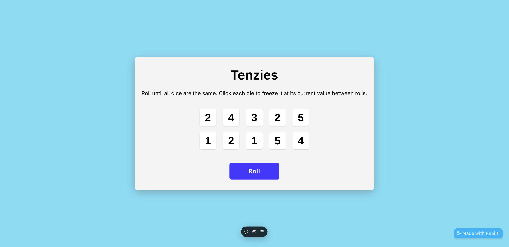
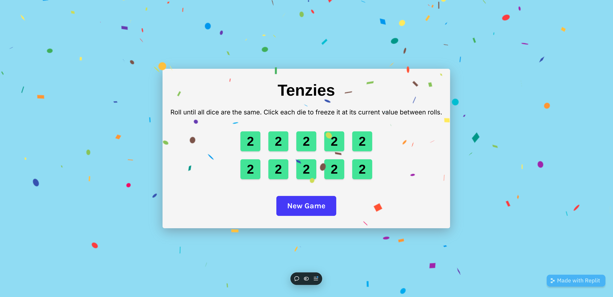

## Running React on Repl.it

[React](https://reactjs.org/) is a popular JavaScript library for building user interfaces.

[Vite](https://vitejs.dev/) is a blazing fast frontend build tool that includes features like Hot Module Reloading (HMR), optimized builds, and TypeScript support out of the box.

Using the two in conjunction is one of the fastest ways to build a web app.

--visit site url: https://tenzies-game-jet-six.vercel.app/

### Getting Started

**Tenzies start game screenshot**

**Screenshot of winning state of the tenzies game**
